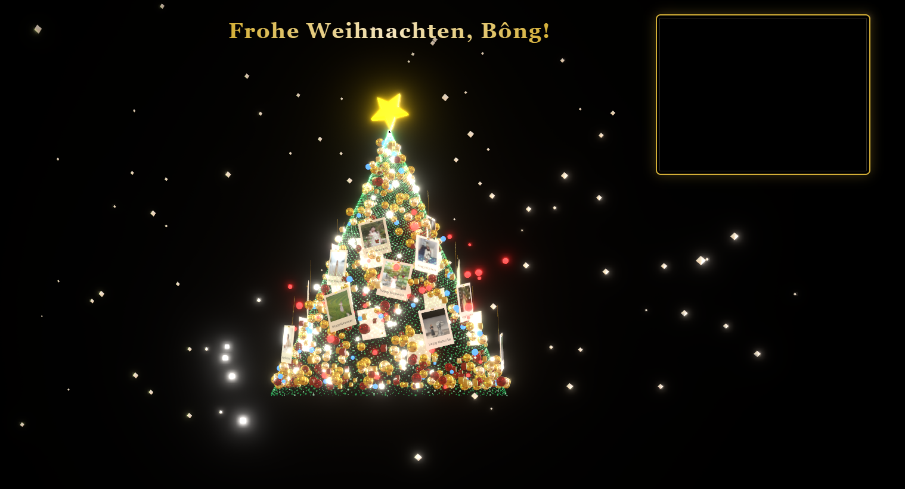

# 🎄 Interactive Christmas Tree - 互动圣诞树

一个使用网络摄像头手势识别技术展示Polaroid风格纪念相册的3D互动圣诞树应用。


## ✨ 主要功能

### 🎅 两种显示模式
- **圣诞树模式 (FORMED)**: 美丽的3D圣诞树，带有闪烁的灯光效果
- **礼盒模式 (CHAOS)**: 漂浮的礼盒，具有独特的粒子效果

### 👋 手势控制
使用MediaPipe手势追踪进行识别和控制：
- **移动手部**: 控制3D空间中的相机/视角位置
- **张开手掌 / 握拳**: 在圣诞树模式和礼盒模式之间切换
- **同时两只手**: 显示最近的纪念照片，配以奢华的Polaroid相框

### 📸 纪念相册
- 自动从 `/public/photos` 目录加载照片
- 以Polaroid风格显示照片，带有金色效果
- 在照片查看模式下移动一只手来查看下一张照片
- 支持多张照片（当前默认22张）

### 🎨 豪华界面
- 金色主题 (#D4AF37) 奢华设计
- 经典的serif字体Cinzel排版
- 流畅的模糊、阴影和动画效果
- 响应式设计，适配各种屏幕尺寸
- 额外添加了灯效、雪花效果等
- 烟花模式
- 礼盒模式
- 信件模式

## 🛠️ 使用的技术

### 前端框架
- **React 19.2** - UI框架
- **TypeScript 5.8** - 类型安全的开发
- **Vite 6.2** - 构建工具和开发服务器

### 3D图形
- **Three.js 0.181** - WebGL 3D库
- **@react-three/fiber** - Three.js的React渲染器
- **@react-three/drei** - R3F的辅助工具
- **@react-three/postprocessing** - 后处理效果

### AI与计算机视觉
- **@mediapipe/tasks-vision 0.10.3** - 手势识别
- 网络摄像头集成用于实时追踪

### 工具库
- **nanoid** - 唯一ID生成
- **AWS SDK S3** - 云存储集成（可选）

## 📁 项目结构

```
christmas-tree/
├── components/
│   ├── Experience.tsx      # 主要的3D场景组件
│   ├── Foliage.tsx        # 圣诞树树叶
│   ├── TreeStar.tsx       # 顶部的星星装饰
│   ├── Polaroids.tsx      # 照片框（Polaroid风格）
│   ├── GestureController.tsx  # 手势检测
│   └── UIOverlay.tsx      # UI覆盖层和说明
├── api/
│   ├── upload.ts          # 照片上传API
│   ├── share.ts           # 分享功能
│   └── ...
├── public/
│   └── photos/            # 相册目录
│       ├── photo1.jpg
│       ├── photo2.jpg
│       └── ...
├── App.tsx                # 根应用组件
├── types.ts               # TypeScript类型定义
└── vite.config.ts         # Vite配置

```

## 🚀 安装和运行

### 系统要求
- Node.js 16.x 或更高版本
- npm 或 yarn
- 网络摄像头用于手势识别功能

### Node.js/npm 环境配置

如果您的系统尚未安装 Node.js/npm，请按以下步骤安装：

**问题现象**：运行 `npm install` 或 `npm run dev` 时提示 "command not found: npm"

**解决方案**：
```bash
# 安装 Node Version Manager (nvm)
curl -o- https://raw.githubusercontent.com/nvm-sh/nvm/v0.39.0/install.sh | bash

# 重新加载终端配置
source ~/.zshrc

# 安装最新版 Node.js
nvm install node

# 验证安装
node --version
npm --version
```

### 安装依赖

```bash
npm install
```

此命令将自动：
1. 安装所有依赖
2. 下载MediaPipe模型用于手势追踪（通过postinstall钩子）

### 运行开发服务器

```bash
npm run dev
```

应用将在 [http://localhost:3010](http://localhost:3010) 运行（根据终端提示 可能地址不同）

### 生产构建

```bash
npm run build
```

构建输出将在 `dist/` 目录中生成

### 预览生产构建

```bash
npm run preview
```

### 使用Vercel开发服务器运行

```bash
npm run dev:vercel
```

## 📸 添加照片到相册

1. 将您的照片放入 `public/photos/` 目录
2. 文件命名格式：`photo1.jpg`, `photo2.jpg`, `photo3.jpg`, ...
3. 支持格式：`.jpg`, `.jpeg`, `.png`, `.JPG`, `.JPEG`, `.PNG`
4. 应用将在启动时自动加载22张照片（布局设计为22张照片，可以增加照片数量，但需要调整布局）

**注意**：照片将以正方形比例（aspect-ratio: 1:1）显示，以适应Polaroid相框。

## 🎮 使用指南

### 启动
1. 打开应用并允许摄像头访问
2. 确保您的手部照明良好
3. 与摄像头保持40-60cm距离

### 基本控制

**移动视角：**
- 将一只手放在摄像头前
- 上下左右移动手部来控制视角

**切换模式：**
- **张开手掌** (手指伸展) → 圣诞树模式
- **握拳** (握紧拳头) → 礼盒模式

**查看纪念照片：**
1. 在礼盒模式下，将**两只手**都放在摄像头前
2. 最近的照片将以Polaroid相框显示
3. 移动一只手向左/右来查看下一张照片

## 🎨 自定义

### 更改主题颜色

在以下文件中查找并更改金色：
- `#D4AF37` - 主金色
- `#F5E6BF` - 浅金色
- `#C5A028` - 深金色

### 更改信息

在 [components/UIOverlay.tsx](components/UIOverlay.tsx#L21) 中编辑标题：

```tsx
Merry Christmas！ ！！
```

### 调整照片数量

在 [App.tsx](App.tsx#L65) 中更改：

```tsx
const maxPhotos = 22; // 最大照片数量
```

## 🎯 性能优化

应用已针对性能进行了优化：
- 抗锯齿：关闭以提高FPS
- DPR：限制在 [1, 2] 以平衡质量/性能
- 错误边界：优雅处理3D资源加载错误
- Suspense：延迟加载组件

## 🐛 错误处理

### 摄像头不工作
- 检查浏览器中的摄像头权限
- 尝试刷新页面
- 检查没有其他应用正在使用摄像头

### 照片不显示
- 检查照片是否正确放置在 `public/photos/` 中
- 检查文件名格式正确：`photo1.jpg`, `photo2.jpg`, 等
- 查看控制台日志了解已加载的照片数量

### 性能低下
- 减少照片数量
- 减小照片文件大小（上传前优化）
- 尝试关闭一些后处理效果

## ⚠️ 常见运行问题及解决方案

### 应用启动后界面卡顿或无响应

**问题现象**：应用启动成功但界面无法正常显示，一直处于卡顿状态

**根本原因**：
1. **严重的性能问题**：应用默认渲染12000个树叶粒子、600个装饰品，以及复杂的后处理效果
2. **3D资源加载阻塞**：大量粒子和特效导致GPU/CPU负载过高
3. **设备性能不足**：低端设备无法处理如此复杂的3D场景

**解决方案**：

#### 方法1：优化粒子数量（推荐）
在 `components/Experience.tsx` 中修改：
```tsx
// 将这些数值调低
<Foliage mode={mode} count={3000} />  // 从12000降到3000
<Ornaments mode={mode} count={150} />  // 从600降到150
```

#### 方法2：降低渲染质量
在 `App.tsx` 的 Canvas 配置中修改：
```tsx
<Canvas
  dpr={[1, 1]}  // 从 [1, 2] 改为 [1, 1]
  gl={{
    antialias: false,  // 关闭抗锯齿
    stencil: false,
    alpha: false,
    powerPreference: "low-power"  // 优先使用低功耗GPU
  }}
  // ... 其他配置
>
```

#### 方法3：简化后处理效果
在 `components/Experience.tsx` 中注释掉部分效果：
```tsx
<EffectComposer enableNormalPass={false}>
  <Bloom intensity={0.8} radius={0.4} />  {/* 降低强度 */}
  {/* 注释掉以下效果以提升性能 */}
  {/* <Vignette /> */}
  {/* <Noise /> */}
</EffectComposer>
```

#### 方法4：检查设备兼容性
- **推荐配置**：配备独立显卡的电脑
- **最低配置**：Intel Core i5 + 8GB RAM
- **浏览器**：使用Chrome或Edge，启用硬件加速

### MediaPipe模型下载失败
**问题现象**：安装依赖时卡在下载模型步骤

**解决方案**：
```bash
# 手动下载模型
npm run download-model

# 或者直接运行脚本
node scripts/download-model.js
```

### 照片不自动加载
**问题现象**：应用启动后提示"无照片"或照片无法显示

**解决方案**：
1. 确保照片文件位于 `public/photos/` 目录
2. 文件命名必须遵循格式：`photo1.jpg`, `photo2.jpg`, `photo3.jpg` 等
3. 支持的格式：`.jpg`, `.jpeg`, `.png`（大小写不敏感）
4. 检查控制台是否有加载错误信息

### 手势识别不灵敏或不工作
**问题现象**：手势控制无响应或反应迟钝

**解决方案**：
1. **环境要求**：
   - 充足的光线照射手部
   - 与摄像头距离40-60cm
   - 避免背景复杂或光线不均

2. **浏览器设置**：
   - 确保允许摄像头权限
   - 在浏览器设置中启用"硬件加速"
   - 尝试刷新页面重新授权

3. **性能优化**：
   - 降低粒子数量（见上面的性能优化方法）
   - 关闭不必要的浏览器扩展
   - 使用最新版本的Chrome或Edge浏览器

## 📝 其他脚本

```bash
# 手动下载MediaPipe模型
npm run download-model
```

## 🌟 致谢

- **3D图形**: Three.js & React Three Fiber
- **手势追踪**: Google MediaPipe
- **设计**: 受传统圣诞美学启发的豪华金色主题
- **字体**: Cinzel (Google Fonts)

## 📄 许可证
私有项目 - 保留所有权利

---

**圣诞快乐！🎄✨**

用 ❤️ 使用React、Three.js和MediaPipe创建 <br>

